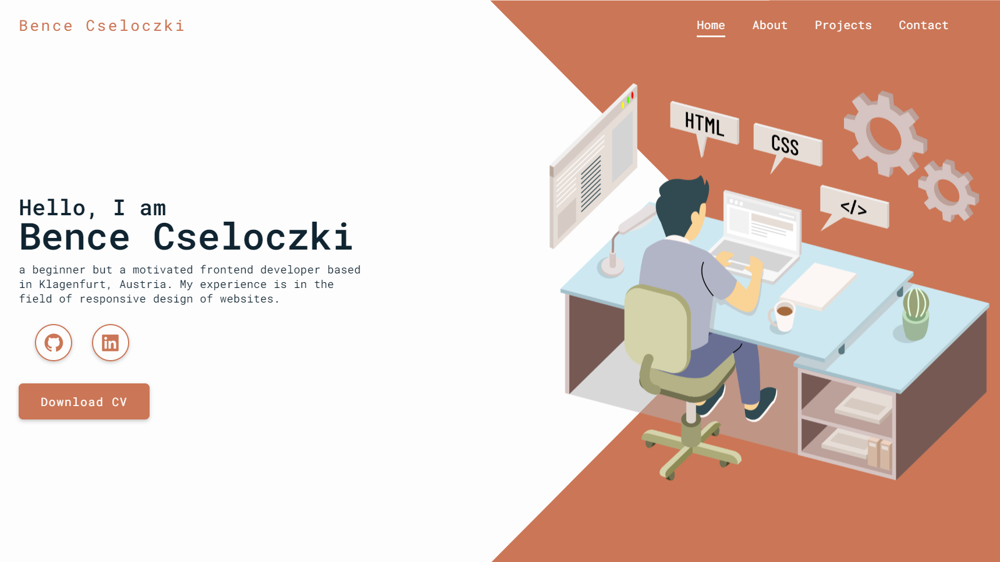

# Portfolio Website ⌨



### Short Description
In this project, my goal was to create a transparent,
simple one-page website, without the use of external sources (e.g. libraries),
so I had the opportunity to demonstrate my pure knowledge of html, css, and a minimal javascript.

---

### Demo - Check my portfolio website live
[LIVE DEMO](https://www.bencecseloczki.com)

---

### Icons & Font
* Icons Link: `<link href='https://unpkg.com/boxicons@2.1.4/css/boxicons.min.css' rel='stylesheet'>`
* Font Link: `<link href="https://fonts.googleapis.com/css2?family=Roboto+Mono:wght@400;600&display=swap" rel="stylesheet">`

---

### Scroll Reveal JS Used
[Open Scroll Reveal JS](https://scrollrevealjs.org/guide/customization.html)

---

### Example of how to use the Scroll Reveal JS
```js
ScrollReveal({ //configure the scroll parameters
    //reset: true, //if it's true we can enables elements returning to their initialized position when they leave the viewport
    distance: '80px', //controls how far elements move when revealed
    duration: 2000, //controls how long animations take to complete
    delay: 200 //the time before reveal animations begin
});

ScrollReveal().reveal('.heading', { origin: 'top', mobile: false }); //here we generates animation styles to 'heading' class (elements come from the top, what is disabled on mobile devices)
```

---

### Give a Star ⭐
If you like this project then give it a **Github** star by pressing the **Star** button ⭐
